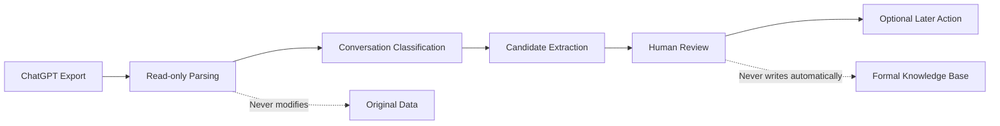

# AI Data Governance · ChatGPT Export Pipeline

[English](README.md) · [中文](README.zh-CN.md)

This repository is the generic open-source edition. It does not include personal exports, review results, or machine-specific project paths.

A small, repeatable pipeline for turning a ChatGPT Export into reviewable knowledge and personal-memory candidates.

It provides an optional local review page, but it does not make the final value decision for you and never writes candidates into a formal knowledge base automatically.

## Project overview

This is a local data-governance tool for ChatGPT Exports. It reads exported conversations and turns potentially valuable knowledge, project experience, and personal memories into reviewable candidates.

It does not delete original data, write to a formal knowledge base, or automatically treat plans and AI suggestions as personal facts.

## When this is useful

If you switch ChatGPT accounts often, or want to bring one account's exported conversations to your local machine, this tool works as a small staging and review step. It reads the export, surfaces knowledge, project experience, and personal records that may be worth keeping, and leaves the final decision to you.

It is useful for account migration, filtering an export, and recovering valuable material from long-running chats. It is not meant to turn every conversation into a knowledge base with one click.

## Workflow



## Scope

- Supports ChatGPT Export files named `conversations.json` and `conversations-*.json` only.
- Uses Python 3.10+ standard-library modules only.
- Does not connect to a database, provide a platform service, or require a UI application.
- Does not modify, move, or delete the original export.
- Personal-memory candidates come only from user self-reports. Plans, hypotheses, quotes, and uncertain statements are not treated as facts.
- Review results are human decisions and require separate authorization before any later action.

## Usage

Run from the project root:

```powershell
python chatgpt_import_pipeline/scripts/import_chatgpt.py "C:\path\to\ChatGPT Export" --output ".\runs\first-import"
```

The output directory must be a new directory under the project root. The first run creates an inventory, classification report, knowledge candidates, memory candidates, an import report, and import history.

For a simple incremental run, pass the `import_history.json` from a previous complete output:

```powershell
python chatgpt_import_pipeline/scripts/import_chatgpt.py "C:\path\to\ChatGPT Export" --output ".\runs\second-import" --history ".\runs\first-import\import_history.json"
```

## Optional human review

```powershell
python chatgpt_import_pipeline/scripts/create_review_dashboard.py ".\runs\first-import"
```

The generated bridge binds to `127.0.0.1`, serves only the review page and a snapshot-checked review endpoint, and never serves the raw result file. It validates the candidate snapshot before saving. It does not modify candidates, the original export, or a formal knowledge base.

When reusing V1.2 import history, V1.3 reprocesses conversations in the supplied export once under the updated extraction rules, while retaining and merging the prior candidate snapshot.

## Testing

```powershell
python -m unittest discover -s chatgpt_import_pipeline/tests -v
```

The tests use synthetic data and do not require a real ChatGPT Export.

## Privacy

Real exports, generated reports, and review results may contain private titles, excerpts, source references, local paths, or hashes. Do not commit real import output to a public repository. See `.gitignore` and [PRIVACY.md](PRIVACY.md).

The vendored `chatgpt_import_pipeline/vendor/chatgpt_source_parser.py` is a small read-only in-memory parser and does not inspect or write a personal knowledge base.

## License

This project currently includes an MIT license draft. Confirm the copyright holder and final license before redistributing it.
