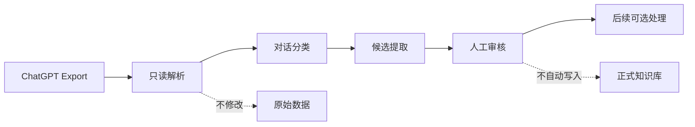

# AI 数据治理 · ChatGPT Export Pipeline

[English](README.md) · [中文](README.zh-CN.md)

本仓库是通用开源版，不包含个人导出数据、审核结果或特定电脑上的项目路径。

一个只处理 ChatGPT Export 的小型、可重复运行的候选整理工具。

它会把导出的对话整理成待审核的知识候选和个人记忆候选，并提供一个可选的本地审核页面。它不替用户做最终价值判断，也不会自动把候选写入正式知识库。

## 项目介绍

这是一个本地运行的 ChatGPT Export 数据治理工具。它会读取 ChatGPT 导出的对话，把可能有长期价值的知识、项目经验和个人记录整理成候选内容，再交给用户人工审核。

它不会自动删除原始数据，不会自动写入正式知识库，也不会把计划或 AI 建议当成个人事实。

## 什么时候适合用

如果你经常更换 ChatGPT 账号，或者想把某个账号的聊天记录导出到本地，这个工具可以作为中间整理步骤：先读取导出的对话，再把可能值得留下的知识、项目经验和个人记录列出来，最后由你自己决定保留什么。

它适合账号迁移前整理、导出数据后的筛选，以及从长期聊天中找回有价值的内容；不适合把所有聊天一键变成知识库，也不替你做最终判断。

## 工作流程



## 项目边界

- 只支持 ChatGPT Export 的 `conversations.json` 与 `conversations-*.json`。
- 只使用 Python 3.10+ 标准库，不连接数据库，不提供平台服务，也不要求安装 UI 应用。
- 不修改、移动或删除原始导出文件。
- 个人记忆候选只来自用户自述；计划、假设、引用和不确定内容不能直接当作事实。
- 审核结果代表人工意见，后续执行必须另行确认。

## 使用方法

在项目根目录运行：

```powershell
python chatgpt_import_pipeline/scripts/import_chatgpt.py "C:\path\to\ChatGPT Export" --output ".\runs\first-import"
```

输出目录必须是项目根目录下尚不存在的新目录。首次运行会生成对话清单、分类报告、知识候选、个人记忆候选、导入报告和导入历史。

如果要做简单增量导入，可以传入上一次完整输出中的 `import_history.json`：

```powershell
python chatgpt_import_pipeline/scripts/import_chatgpt.py "C:\path\to\ChatGPT Export" --output ".\runs\second-import" --history ".\runs\first-import\import_history.json"
```

## 可选人工审核

```powershell
python chatgpt_import_pipeline/scripts/create_review_dashboard.py ".\runs\first-import"
```

生成的桥接服务只绑定到 `127.0.0.1`，只提供审核页面和经过快照校验的审核接口，不直接暴露审核结果 JSON 文件。保存前会校验候选快照，不会修改候选文件、原始导出或正式知识库。

如果复用 V1.2 的导入历史，V1.3 会按更新后的提取规则重新处理本次导出中的对话一次，同时保留并合并此前的候选快照。

## 测试

```powershell
python -m unittest discover -s chatgpt_import_pipeline/tests -v
```

测试使用合成数据，不需要真实的 ChatGPT Export。

## 隐私

真实导出、生成的报告和审核结果可能包含私人标题、内容摘录、来源引用、本地路径或哈希。不要把真实导入结果提交到公开仓库。请参阅 [.gitignore](.gitignore) 和 [PRIVACY.md](PRIVACY.md)。

随附的 `chatgpt_import_pipeline/vendor/chatgpt_source_parser.py` 是本工具运行所需的只读内存解析器，不会读取或写入个人知识库。

## 许可证

当前附带 MIT 许可证草案。公开发布前请确认版权主体和最终许可证选择。
